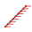
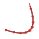
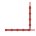
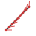
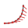

Pedro routes: a cheat sheet
===========================

Every way to say where the robot should go, and which ones to avoid.
Measured against ``com.pedropathing:core:3.0.1``, the version this project
pins, on 2026-09-29. Where the documentation and the jar disagree, the jar
is what is written here.

In the pictures the black line is where the robot drives and each red pin is
its nose, sampled every eighth of the way along. Both come from
``Path.get(t)`` and ``Path.heading(t)``, so they are the library's own
output rather than a drawing of it.

The shapes
----------

A route is a shape plus a heading rule. There are four shapes.

.. list-table::
   :header-rows: 1
   :widths: 30 70

   * - Shape
     - What it is
   * - ``Paths.line(start, end)``
     - A straight line between two poses.
   * - ``Paths.curve(start, control..., end)``
     - A Bézier curve. The first and last poses are the ends; every pose
       between them pulls the curve without being touched.
   * - ``Paths.through(poses...)``
     - A curve that passes through every pose given.
   * - ``Paths.path(paths...)``
     - Several paths run as one, in order.

``line``
~~~~~~~~

Two poses, nothing between them. ``line(start, end).constant(start)`` is the
plainest route there is and the one to reach for first.

``curve``
~~~~~~~~~

The control pose is a magnet, not a waypoint: the curve bends toward it and
never reaches it. Its heading is ignored.

``through``
~~~~~~~~~~~

Every pose is on the route. The cost is at the ends: with ``tangent()`` the
nose starts at -18.4 degrees and finishes at 108.4 degrees on the same three
poses where ``curve`` runs 0 to 90, because the spline arrives at an angle.
Check the end heading rather than assuming it.

``path``
~~~~~~~~

Two legs of a route, joined. The nose snaps at the corner rather than easing
round it: measured 0 degrees for the first leg and 90 for the second, with
nothing in between.

The heading rules
-----------------

.. list-table::
   :header-rows: 1
   :widths: 28 44 28

   * - Rule
     - What it does
     - Use it?
   * - ``constant(pose)``
     - Holds that pose's heading the whole way.
     - Yes.
   * - ``constant(radians)``
     - The same, from a number.
     - Careful: radians.
   * - ``tangent()``
     - Nose follows the direction of travel.
     - Yes.
   * - ``reverseTangent()``
     - Tangent plus 180 degrees, for driving backwards.
     - Yes.
   * - ``facingPoint(pose)``
     - Nose always aimed at one spot on the field.
     - Yes, with one edge.
   * - ``linear(a, b)``
     - Sweeps from one heading to another along the route.
     - Not on a line.
   * - ``longLinear(a, b)``
     - The same, taking the long way round.
     - No.
   * - ``Interpolator.piecewise()``
     - A different rule on each stretch of the route.
     - Untested here.

There is no default
~~~~~~~~~~~~~~~~~~~

The documentation says ``tangent()`` "is the default interpolation type when
you create a path". It is not. A path with no heading rule throws as soon as
anything asks for a heading:

.. code-block:: text

   java.lang.UnsupportedOperationException: No heading interpolator set.

So every route needs a rule. It is not optional.

The number form is radians
~~~~~~~~~~~~~~~~~~~~~~~~~~

``constant(90)`` is not 90 degrees. It is 90 radians, which wraps to
116.6 degrees. ``constant(0)`` is safe only because zero is the same in both.

Two ways to avoid it. Pass a pose, ``constant(start)``, and the heading comes
from the pose. Or convert, ``constant(Math.toRadians(90))``. A pose built by
``PoseFactory.degrees()`` converts for you; ``constant`` does not.

Do not use ``linear()`` on a line
---------------------------------

Asked to sweep from 0 to 90 degrees along a line, 3.0.1 sweeps from 90 to 0.
Measured:

.. code-block:: text

   line(s, e).linear(0, toRadians(90))    t=0  90.0    t=0.5  45.0    t=1   0.0
   line(s, e).linear(e, s)   swapped      t=0   0.0    t=0.5  45.0    t=1  90.0

The end pose is wrong too: ``endPose().heading()`` reports the start heading.

This is `issue 176 <https://github.com/Pedro-Pathing/PedroPathing/issues/176>`_,
with `180 <https://github.com/Pedro-Pathing/PedroPathing/issues/180>`_ and
`181 <https://github.com/Pedro-Pathing/PedroPathing/issues/181>`_ reporting the
same thing. The cause given there is ``Curve.pathCompletion()`` returning the
fraction of the path remaining rather than the fraction completed. All three
are closed, and 3.0.1 still does it.

The workaround in those issues is to swap the arguments, and it works, and it
reads as a mistake to whoever finds it next. It also fails for a 180 degree
turn, where the two ways round are the same distance.

**On a curve, ``linear()`` is correct.** Measured on the same three poses:
``curve(s, m, e).linear(0, toRadians(90))`` runs 0, 24.6, 45, 90. So the bug is
the line's, which is what issue 176's title says: line and compound paths.

Two ways round it on a straight leg. Hold one heading with ``constant`` and put
the turn on its own leg. Or make the leg a shallow ``curve``, where ``linear``
behaves.

``longLinear()`` is reversed the same way
-----------------------------------------

``longLinear(0, toRadians(90))`` runs 90, 157.5, 225, then 0 at the end. Neither
end is what was asked for. It is undocumented as well: the documentation page
lists tangent, linear, constant, facingPoint, piecewise and custom, and not this.

``facingPoint()`` has one edge
------------------------------

It works: the nose tracks the point as the robot moves. The edge is a route that
starts *at* the point it faces, where there is no direction to face. Measured on
a line leaving the point, the heading reads 0 at ``t=0`` and the correct
-135 degrees from the next sample on, so the first instant is a discontinuity.
`Issue 69 <https://github.com/Pedro-Pathing/PedroPathing/issues/69>`_ is about
this interpolator; it is closed.

What this page does not cover
-----------------------------

- ``Interpolator.piecewise()``, which nothing here has run.
- Custom interpolators.
- Deceleration, path and end constraints, and foresight, each of which has its
  own reference page and changes how a route is driven rather than what it is.
- Whether any of this behaves on a floor. Everything above is the library's own
  arithmetic, read out of the jar. When the simulator and the robot disagree,
  the robot is right.
